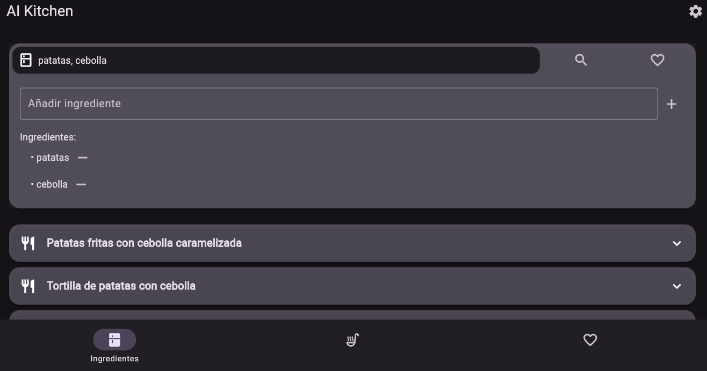
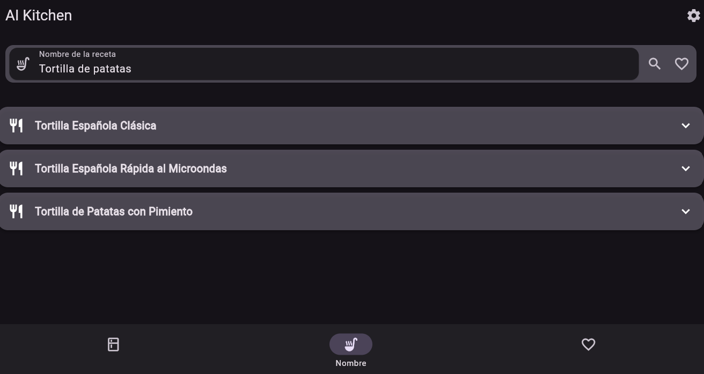

# 🍳 AiKitchen 🍲

¡Bienvenido a **AiKitchen**! 🎉 Esta es tu aplicación definitiva para descubrir recetas deliciosas a partir del nombre de una receta o de una lista de ingredientes. Además, puedes guardar tus recetas favoritas para visitarlas en el futuro, tanto en Android como desde el navegador. 📱💻

## ✨ Características

- **🔍 Buscar por Ingredientes**: Introduce una lista de ingredientes y obtén recetas que los incluyan. ¡Perfecto para aprovechar lo que tienes en casa! 🥕🍅
- **🔎 Buscar por Nombre**: Introduce el nombre de una receta y obtén recetas relacionadas. ¡Encuentra esa receta que tanto te gusta! 🍝🍲
- **❤️ Guardar Favoritos**: Guarda tus recetas favoritas para acceder a ellas fácilmente en el futuro. ¡Nunca pierdas de vista tus platos preferidos! 📚✨
- **🍳 Comparte tus recetas favoritas**: Comparte las recetas que quieras compartir con tus amigos o familiares. 🧑‍🍳
- **✍️ Crea tus recetas: Crea tus propias** recetas para poder guardarlas para el futuro.
- **✏️ Edita recetas existentes**: Si tienes mejoras de una receta que te han pasado o de una que se ha generado por la IA, no te preocupes, solo edítala y quédate con la versión actualizada.

## 🚀 Instalación

### 📱 Android (Play Store)
1. **Descargar la aplicación**: [Enlace de la play store](https://play.google.com/store/apps/details?id=com.N3k0chan.aikitchen)
2. **Introduce tu clave de Groq** en Ajustes. Sin ella no funcionan las recetas generadas por IA.
3. **¡Disfruta!**: Abre AiKitchen y empieza a explorar recetas deliciosas. 🍽️

### 📱 Android (APK)

1. **Descarga la APK**: [Enlace de descarga](https://github.com/enekor/aikitchen/releases/latest)
2. **Instala la aplicación**: Abre el archivo APK descargado y sigue las instrucciones en pantalla.
3. **¡Disfruta!**: Abre AiKitchen y empieza a explorar recetas deliciosas. 🍽️

### 🌐 Web

1. **Visita la aplicación en la web**: [AiKitchen Web](https://enekor.github.io/AiKitchen/)
2. **Introduce tu clave de Groq** en Ajustes. En la versión web la clave la pone cada usuario y se guarda solo en su navegador.
3. **Explora recetas**: Usa las funciones de búsqueda para encontrar recetas por ingredientes o nombre.
4. **¡Cocina y disfruta!**: Sigue las recetas y disfruta de tus creaciones culinarias. 👩‍🍳👨‍🍳

#### Qué cambia en la versión web

Todas las funciones están disponibles, con algunas salvedades propias del navegador:

- **Datos guardados**: favoritos, menú semanal, lista de la compra y ajustes viven en el almacenamiento local del navegador, no en SQLite. Son propios de ese navegador y se pierden al borrar los datos del sitio.
- **Recetas de webs externas**: un navegador no deja leer otras webs directamente. Las peticiones a Lidl, Cookpad y a las URL que introduzcas pasan por un proxy configurable en Ajustes. Viene uno público por defecto; para algo estable, pon uno propio.
- Los widgets de pantalla de inicio y la recepción de ficheros compartidos son de Android y no aparecen en web.

#### Compilar para web

```bash
flutter build web --release --base-href "/AiKitchen/"
```

El `--base-href` es obligatorio si se sirve desde una subruta, como en GitHub Pages. Sin él, todos los recursos dan 404.

La clave de Groq no se empaqueta nunca en el build: la introduce cada usuario en Ajustes y se queda en su dispositivo.

## 📸 Capturas de Pantalla




---

¡Gracias por usar **AiKitchen**! Esperamos que disfrutes cocinando tanto como nosotros disfrutamos desarrollando esta aplicación. 🍽️🎉
