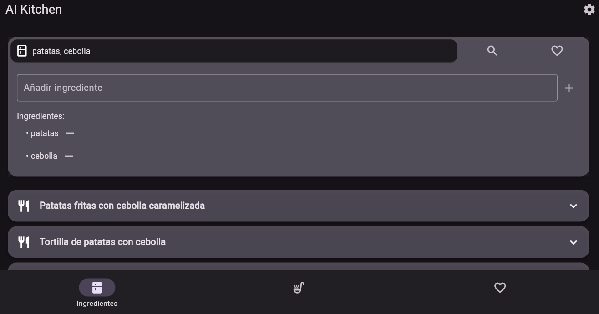
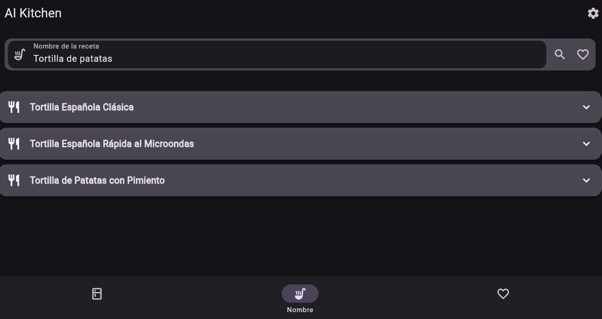

# 🍳 AiKitchen 🍲

¡Bienvenido a **AiKitchen**! 🎉 Esta es tu aplicación definitiva para descubrir recetas deliciosas a partir del nombre de una receta o de una lista de ingredientes. Además, puedes guardar tus recetas favoritas para visitarlas en el futuro. La opción de guardar recetas favoritas está disponible únicamente en la versión para Android. 📱

## ✨ Características

- **🔍 Buscar por Ingredientes**: Introduce una lista de ingredientes y obtén recetas que los incluyan. ¡Perfecto para aprovechar lo que tienes en casa! 🥕🍅
- **🔎 Buscar por Nombre**: Introduce el nombre de una receta y obtén recetas relacionadas. ¡Encuentra esa receta que tanto te gusta! 🍝🍲
- **❤️ Guardar Favoritos**: Guarda tus recetas favoritas para acceder a ellas fácilmente en el futuro (disponible solo en Android). ¡Nunca pierdas de vista tus platos preferidos! 📚✨
- **🍳 Comparte tus recetas favoritas**: Comparte las recetas que quieras compartir con tus amigos o familiares. 🧑‍🍳
- **✍️ Crea tus recetas: Crea tus propias** recetas para poder guardarlas para el futuro.
- **✏️ Edita recetas existentes**: Si tienes mejoras de una receta que te han pasado o de una que se ha generado por la IA, no te preocupes, solo edítala y quédate con la versión actualizada.

## 🚀 Instalación

### 📱 Android (Play Store)
1. **Descargar la aplicación**: [Enlace de la play store](https://play.google.com/store/apps/details?id=com.N3k0chan.aikitchen)
2. **¡Disfruta!**: Abre AiKitchen y empieza a explorar recetas deliciosas. 🍽️
   
### 📱 Android (APK)

1. **Descarga la APK**: [Enlace de descarga](https://github.com/enekor/aikitchen/releases/latest)
2. **Instala la aplicación**: Abre el archivo APK descargado y sigue las instrucciones en pantalla.
3. **¡Disfruta!**: Abre AiKitchen y empieza a explorar recetas deliciosas. 🍽️

### 🌐 Web

1. **Visita la aplicación en la web**: [AiKitchen Web](https://enekor.github.io/AiKitchen/)
2. **Explora recetas**: Usa las funciones de búsqueda para encontrar recetas por ingredientes o nombre.
3. **¡Cocina y disfruta!**: Sigue las recetas y disfruta de tus creaciones culinarias. 👩‍🍳👨‍🍳

## 📸 Capturas de Pantalla

---

¡Gracias por usar **AiKitchen**! Esperamos que disfrutes cocinando tanto como nosotros disfrutamos desarrollando esta aplicación. 🍽️🎉
